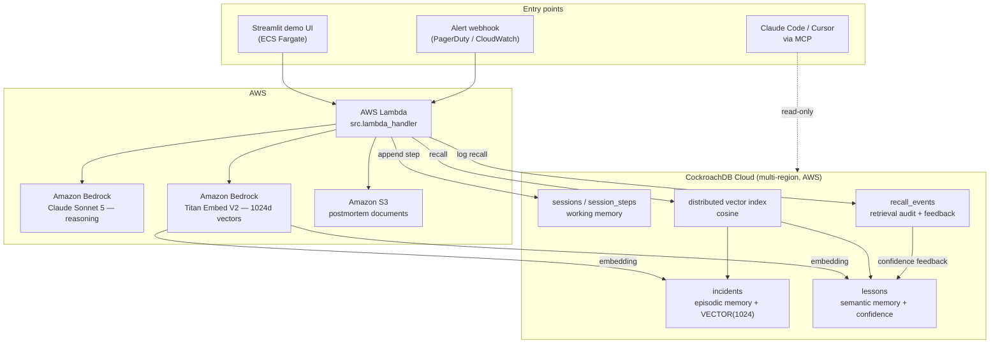

# Architecture

## The loop

1. An alert arrives at the Lambda.
2. A session row is opened — **working memory now exists on disk**, before any
   reasoning happens. If the Lambda is killed, the trace survives.
3. Claude (Bedrock) calls `recall_similar_incidents`. The alert is embedded via
   Titan, and the vector goes through CockroachDB's distributed vector index.
4. Claude calls `recall_lessons` — ranked by similarity *and* by how often each
   lesson has held up (`confidence`).
5. Claude answers, grounded in what actually fixed the problem last time.
6. Claude calls `record_finding` exactly once. The new incident row and its
   embedding are written **in a single transaction**.
7. Every retrieval is logged to `recall_events`. Human thumbs-up/down adjusts
   lesson confidence, so bad memories decay and good ones get stickier.

## Why this needs CockroachDB specifically

- **One transaction across vector and row.** A resolution and its embedding
  commit together. With a bolted-on vector store there is always a window where
  the index disagrees with the system of record — and an agent that retrieves
  during that window recalls something that is not true.
- **Working memory that outlives the process.** Serverless agents die mid-run.
  Steps are appended durably, so a session is resumable and auditable rather
  than lost with the container.
- **No maintenance window.** Memory that goes read-only during an upgrade means
  an on-call agent goes blind exactly when incidents cluster.
- **Multi-region.** The agent recalls with the same latency wherever it runs.
